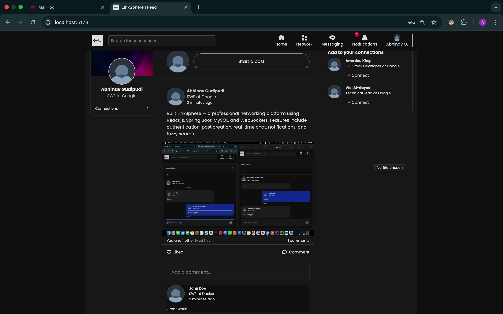
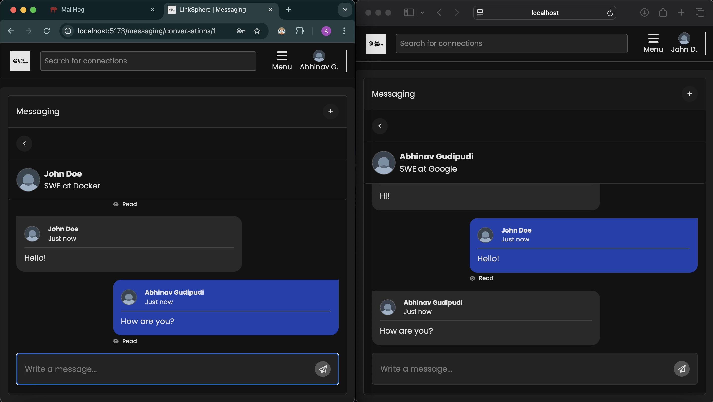
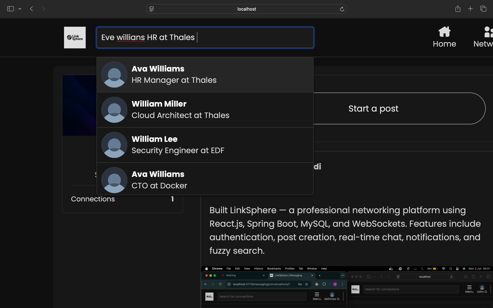
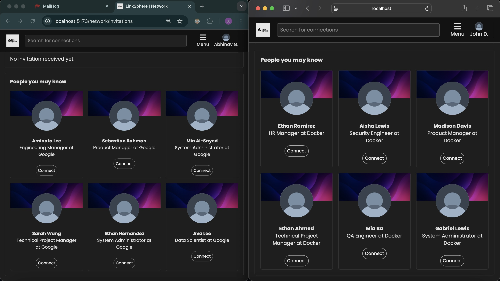

# LinkSphere — Full-Stack Professional Networking Platform

LinkSphere – A full-stack professional networking platform with real-time chat, JWT auth, Google login, personalized feed, and fuzzy search. Built with React, Spring Boot, MySQL, and Docker.
## Demo

### Post Feed with Interaction Controls
  
Users can create posts with text and media. Post owners can edit or delete their own posts, while others can like and comment — all updates are instantly reflected.

### Real-Time Chat Application
  
One-on-one messaging with real-time delivery using WebSockets, complete with read receipts.

### Fuzzy User Search
  
ElasticSearch-powered user search with typo tolerance and autocomplete-style partial match support.

### Personalized Connection Recommendations
  
Each user receives unique recommendations based on their profile and activity patterns.

## Features

- User authentication with Google OAuth and email/password login
- Email verification and password reset functionality
- JWT-based access and refresh token authentication for secure sessions
- Rich post creation with support for text, images, and files
- Like and comment functionality with real-time updates
- Real-time one-on-one messaging using WebSockets
- Fuzzy user search using ElasticSearch and Apache Lucene
- Personalized connection suggestions for every user
- Real-time notifications for likes, comments, and messages
- Clean, responsive frontend built with React.js

## Tech Stack

**Backend**
- Java 21, Spring Boot
- Spring Security, JWT
- MySQL
- ElasticSearch, Apache Lucene
- WebSockets
- SMTP (email verification and reset)

**Frontend**
- React.js


**Dev Tools**
- Docker, Docker Compose
- Git & GitHub
- Postman (API testing)

## Setup Instructions

### Prerequisites

- Java 21 or higher
- Node.js 22+ and npm
- Docker & Docker Compose
- Google OAuth 2.0 Client ID
- MySQL running locally or via Docker

### Google OAuth Setup

Create a Google OAuth 2.0 Client ID from the [Google Developer Console](https://console.developers.google.com/) and use it in both frontend and backend as needed.

### Running the Project Locally

1. **Clone the repository and navigate to the root folder.**

2. **Start the backend:**
   ```bash
   cd backend
   docker-compose up
   ```

3. **Run the Backend:**

   For Mac:
   ```bash
   ./gradlew bootRun
   ```

   For Windows:
   ```bash
   gradlew.bat bootRun
   ```

4. **Start the Frontend:**
   ```bash
   cd frontend
   ```

5. **Set up the necessary environment variables:**

   For Mac:
   ```bash
   cp .env.example .env
   ```

   For Windows:
   ```bash
   copy .env.example .env
   ```

6. **Install frontend dependencies:**
   ```bash
   npm install
   ```

7. **Start the frontend development server:**
   ```bash
   npm run dev
   ```